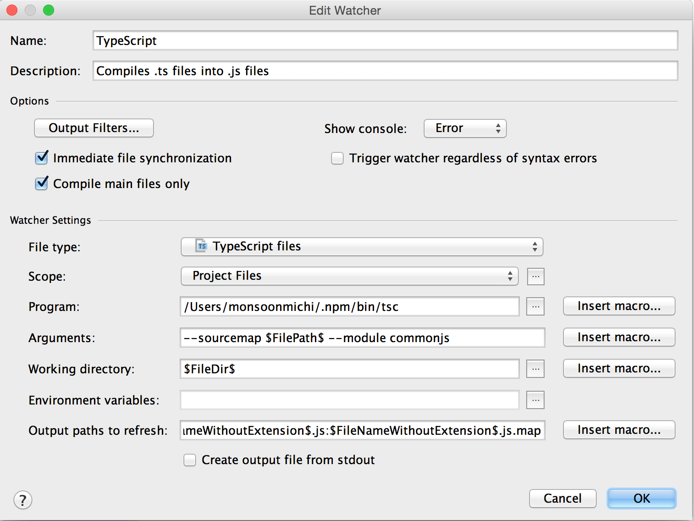
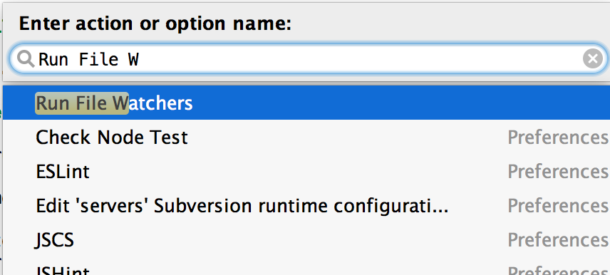
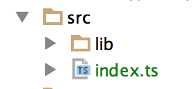
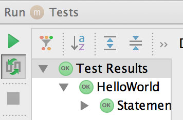

# Overview

This project will help you quickly get started with TypeScript. The setup is streamlined for use in WebStorm, but that is not
a requirement.

Note that this requires that you install `npm` (`node` comes with it: http://nodejs.org/download/). This is because TypeScript
compiles to JavaScript and without Node, you would need to run your code in a browser. Running sample snippets in a browser
adds unnecessary complexity as compared to running Node scripts.

# Installing and running

First install all dependencies:

    npm install

Then you have two options: Use WebStorm or run it yourself.

## Using WebStorm (RECOMMENDED)

1. Setup a Watcher by going to Preferences => Tools => File Watchers => + => TypeScript
2. Change arguments to read `--sourcemap --target ES5 --module commonjs $FilePath$` and Hit OK

3. Select the top level folder of your project in the IDE project navigator to the left
4. Click on "Help" => "Find Action..." in the top menu (or CMD + SHIFT + A)
5. Type in "Run file watcher" and press enter

You should see all TypeScript files have collapsible arrows next to them indicating new generated files. For example:

To run tests:

1. In the top menu, select Run => Edit Configurations... => + => Mocha
2. Name it "Tests"
3. The node interpreter should be populated. If not, use your terminal and type in `which node`
4. The Mocha package should be `/usr/local/lib/node_modules/mocha`, but if it is not, check where yours is installed
via `which mocha`. Replace `bin/mocha` with `lib/node_modules/mocha`.
5. The User Interface is TDD
6. The test directory is the `test` folder in this project

To run it, in the top menu, select Run => Run... => And select Tests.

When you run the tests, you will see output at the bottom. Click on the play button to re-run the tests. Click on the
Auto-Test icon below the play button (see image) to toggle auto-testing (WebStorm will re-run tests on any file change).

## Or run it yourself

First, install new dependencies:

1. Install [Growl](http://growl.info/downloads#growlnotify)
2. Run `npm install growl --save-dev`
3. Run `sudo gem install terminal-notifier`
4. Run `npm install supervisor -g`
5. Run `npm run ts`

This final step is the one that turns on the TDD process and is what you use going forward:

    `npm run watch`

For reference, these are the commands under the hood (but you shouldn't need to run them):

    npm run ts # compiles typescript
    npm test # runs tests

It should reload the tests on each change.

# Notes

* Testing is done using two libraries. One is Mocha, a framework for writing assertions. The other is Sinon, a
stubbing and mocking library.
* You can find the Mocha documentation here: [http://mochajs.org/](http://mochajs.org/#getting-started)
* You can find the Sinon documentation here: [http://sinonjs.org/docs/](http://sinonjs.org/docs/)
* TypeScript declarations are found in `tsd.d.ts`, but are managed using `tsd`. They are like `.h` files in other
languages. If you end up using external libraries such as Underscore.js, you may want to install the dependency
using `tsd install [name] --save` (more on this here: [https://github.com/DefinitelyTyped/tsd](https://github.com/DefinitelyTyped/tsd))